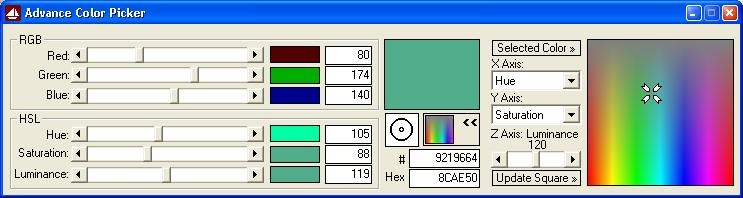

<div align="center">

## Advance Color Picker


</div>

### Description

A code to slice and dice the "Color Cube" in various ways. Select any color on the screen and get the RGB, HSL, color value and HEX value.
 
### More Info
 
Two important functions are borrowed, and credits are given to the original writer.

There are no comments, but anyone with minimal knowledge of VB should be able to understand the code.


<span>             |<span>
---                |---
**Submitted On**   |2003-05-21 11:47:14
**By**             |[Soumen Bhattacharya](https://github.com/Planet-Source-Code/PSCIndex/blob/master/ByAuthor/soumen-bhattacharya.md)
**Level**          |Advanced
**User Rating**    |5.0 (109 globes from 22 users)
**Compatibility**  |VB 6\.0
**Category**       |[Complete Applications](https://github.com/Planet-Source-Code/PSCIndex/blob/master/ByCategory/complete-applications__1-27.md)
**World**          |[Visual Basic](https://github.com/Planet-Source-Code/PSCIndex/blob/master/ByWorld/visual-basic.md)
**Archive File**   |[Advance\_Co1590445212003\.zip](https://github.com/Planet-Source-Code/soumen-bhattacharya-advance-color-picker__1-45619/archive/master.zip)

### API Declarations

```
Public Declare Function GetCursorPos Lib "user32" (lpPoint As POINTAPI) As Long
Public Declare Function GetPixel Lib "gdi32" (ByVal hDC As Long, ByVal X As Long, ByVal Y As Long) As Long
Public Declare Function GetDesktopWindow Lib "user32" () As Long
Public Declare Function GetWindowDC Lib "user32" (ByVal hWnd As Long) As Long
Public Type POINTAPI
 X As Long
 Y As Long
End Type
```


